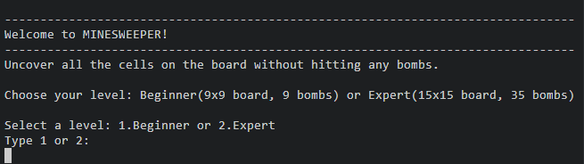
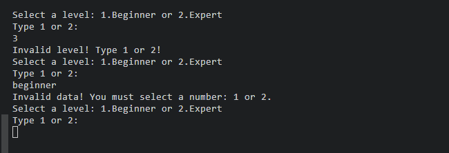

# MINESWEEPER
Minesweeper is a Python command line game, which runs in the Code Institute mock terminal on Heroku.

It is a single-player puzzle game, a terminal version of the classic, well-known Minesweeper game, which can played on two board sizes,
depending on the palyer's skill level: beginner or advanced. The rows and columns are numbered so that the users
can easily choose the coordinates of the cell they want to uncover.

The live version of this project can be found (here).

## How to play

There are two levels of difficulty: beginer and advanced, which set the size of the board and the number of bombs accordingly.
After choosing the level, the objective is to uncover all the cells on the board, avoiding to hit any bombs.

The initial board contains cells whose content is hidden from the user.
The cells can contain bombs, whose location is randomly generated by the compuer, or numbers.

Players are prompted to uncover a cell by typing its coordinates(row and column). If the chosen cell contains a bomb, the game ends, the entire board is revealed and the playe loses. If the cell does not contain a bomb, it shows a number. This number represents the neighbouring bombs of that cell and is an important hint that helps the player choose the next move. If the cell does not have a neighbouring bomb, its number is 0 and the computer automatically uncovers all the cells around it, until a cell with neighboring bombs is found.

The game is won when all the cells that do not contain a bomb have benn revealed.

## Logical Flow Plan

The logic of this game was planned and structured in diagrams with [Lucidchart](https://www.lucidchart.com/pages/):

## Features
### Existing Features

- Levels:
    - The game begins with a brief guidance prompting the player to choose between two levels of difficulty.
    - The first level has a 9x9 board and 9 bombs and the second a 15x15 board and 35 bombs.
    

- Place bombs at a random location and assign numbers to cells:
    - The computer randomly plants the corresponding number of bombs for each level and assigns numbers to each cell, which are kept secret from the player.
    - After choosing the level the player can see the empty board and is prompted to select the coordinates of a cell.
    - The rows and columns are numbered to make it easier for the player to find the coordinates of a cell:

     

- Bombs are represented by _*_
- Recursion was used for the cells that contain a _0_: these cells do not have a neighboring bomb, so all the cells around them are automatically revealed, until a cell that has a bomb around is found:

    

- If the player selects a cell that contains a bomb, the game is over and all the cells are revealed. On the other side, if the player uncovers all the cells that do not contain a bomb, the game is won and the bombs are not revealed(they remain empty cells):

    

- Input validation and error checking

    - The player cannot select another level other then 1 or 2.
    - The player must enter numbers and not other characters.

    

    - The player cannot enter coordinates outside the size of the board.
    - The player must enter numbers and not other characters.
    - Rows and columns are checked individually.

     

    - The player cannot select the same coordinates twice.

    

    - If the cell has already been revealed due to recursion, the player cannot use the coordinates of that cell again.

    

### Future Features

- Implement a flag system and allow the player to mark an empty cell with an  _F_ , to indicate a potential bomb.
- Allow the player to play against computer.

## Programming Model

I have used a GameBoard class to iniialize the board and store its size and number of bombs.

It has methods to create a representation of the board with square cells, numbered row and columns and print it.
I have initialized two instances of the game board: the actual board(_self.board_) and the updated board that the user sees(*self.visible_board*).

The class has methods to plant bombs at a random location, to calculate the number of neighbouring bombs of a cell and to add numbers to cells(representing the number of neighbouring bombs of that cell).
It also has a method to handle the cells, which updates the content of the cells on the palyer's board(*visible_board*) and which also contains the recursion logic.

It has a method to reveal all the bombs on the board if the user selects a cell containing a bomb and a method to check if the game is won.

Outside the GameBoard class I have defined functions to validate the user's input and to update the GameBoard class attributs _size_ and _bombs_ according to the level that the player selects. 
These atributes are then used to create a new instance of the _GameBoard_ (which is stored into a variable) and the new game starts with the parameters that the player chose.

## Testing

### Bugs

#### Solved Bugs

- When I have created the representation of the board I had spacing issues with adding numbers to rows and columns. The numbers were positioned outside the corresponding row/column. To solve this, I have done a research on _Google_ on how to manipulate strings alignment in _Python_ and I have used this method: f"{str(i):>2} which has aligned the column number to the right, with 2 spaces and It has created the right amount of sapce to position it above each column in the middle.

- I have struggled with the implementation of the recursion.I was getting an indexing error. After numerous attempts, I have searched a tutorial on how to achieve that and I have learned that i had to add a min and max to the range in the recursion loop to solve the problem.

- While testing the input validation I have noticed that the player could infinitely select the same coordinates, which were not previously selected. This happened when the player selected a cell that had been uncovered due to recursion. To fix this, I have added another statement to the function that handles the user input, which checkes with the help of another function(_cell_already_revealed()) if the selected cell is empty on the visible board. If it is not empty, it means it has already been revealed and it cannot be revealed twice, so an error is raised.

#### Unsolved Bugs

- There are no unsolved bugs.

### Validator Testing

- PEP8
    - No errors were returned from PEP8 Python Validator.

    

## Deployment

## Credits

- To solve the issue with the numbering of cells and columns I have fund information and examples about the alignment of strings in Python here: 

    https://www.tutorialspoint.com/how-to-align-text-strings-using-python

- To create a representation of the game board with cells, i have found inspiration here:

    https://www.askpython.com/python/examples/create-minesweeper-using-python 

- To implement the recursion I have watched this youtube tutorial(code taken from here for the recursion loop is also marked with a comment above it):

    https://www.youtube.com/watch?v=Fjw7Lc9zlyU